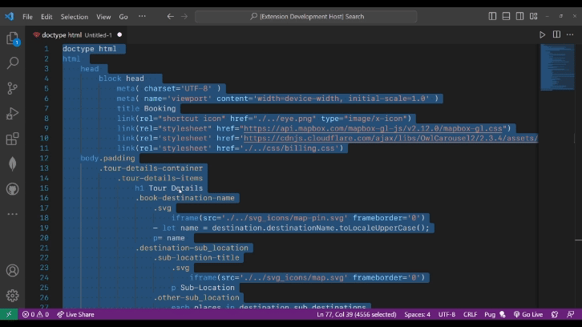
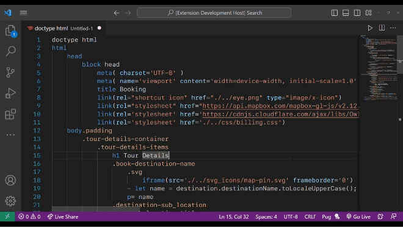

# VSCode Code Sender and Receiver Extension

The VSCode Data Sender and Receiver Extension is a versatile tool that enables seamless data communication between two instances of Visual Studio Code – one acting as the sender and the other as the receiver. This extension can work both over the internet and in offline scenarios, making it a powerful tool for collaborating and sharing data across different environments.

## Features

- **Data Sending:** Send various types of data, such as text snippets, and code, from one instance of VSCode to another vscode.
- **Data Receiving:** Receive data sent from another instance of VSCode, maintaining the integrity of the original content.
- **Internet and Offline Modes:** This extension supports both internet-based communication and direct offline communication through local networks.
- **Secure Communication:** Data transmission is secured through encryption, ensuring that sensitive information remains protected.
- **Easy-to-Use Interface:** The extension integrates seamlessly into the VSCode user interface, providing a user-friendly experience.

## Usage

# Sending Data

### Online Method

1. Open the file, select the portion of code you want to send in the source instance of VSCode.
2. Press CTRL + SHIFT + P or COMMAND + SHIFT + P
3. Select the method "ONLINE".
4. If connected to the internet, and you are far from the reciver friend you can choose to send the data over the internet "ONLINE". If not, select the local network option for offline communication.
5. Copy The 4 digit generated code and send that code to friend.

5. Copy The 4 digit generated code and send that code to friend.

### Offline Method

1. Open the file, select the portion of code you want to send in the source instance of VSCode.
2. make sure both devices should be connected with same hotspot wifi
3. Press CTRL + SHIFT + P or COMMAND + SHIFT + P
4. Copy The 4 digit generated code and send that code to friend.

# Receiving Data

1. Press CTRL + SHIFT + P or COMMAND + SHIFT + P
2. Enter the Code and Choose the send method.
4. Received data will be placed in a the same workspace.

## Receiving Data Offline

## Receiving Data Online

